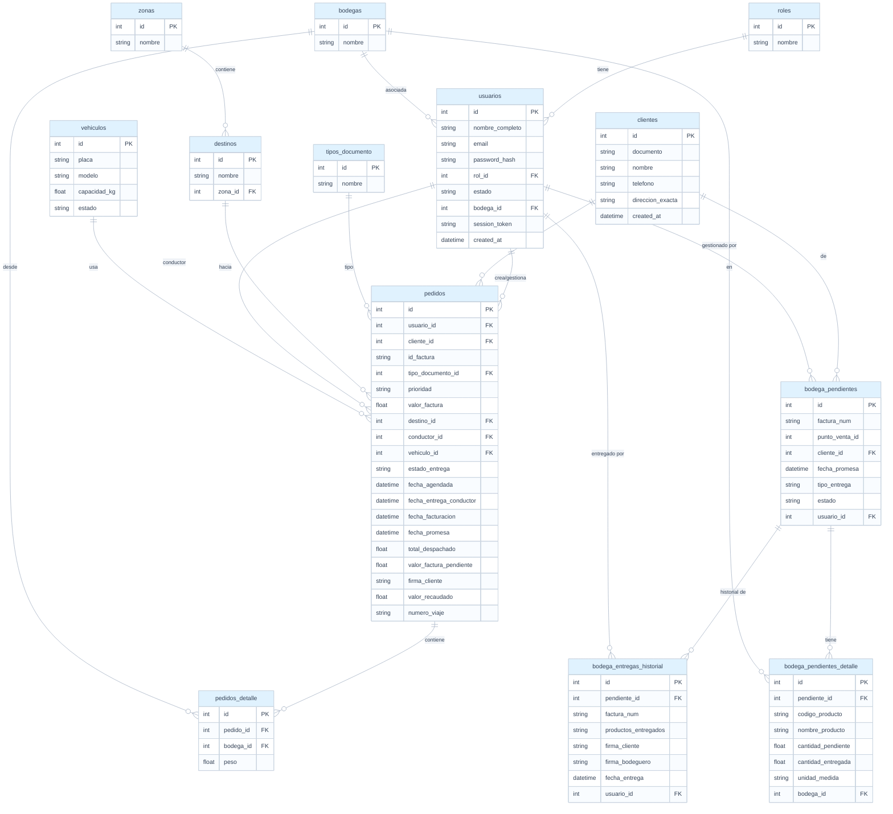

# LogiDespacho

> Sistema web y móvil de gestión logística para el control integral de despachos, rutas, bodegas, conductores y reportes operativos con capacidades de IA.

## Tabla de Contenidos

- [Descripción](#descripción)
- [Funcionalidades](#funcionalidades)
- [Tecnologías](#tecnologías)
- [Arquitectura del Proyecto](#arquitectura-del-proyecto)
- [Arquitectura de la Base de Datos](#arquitectura-de-la-base-de-datos)
- [Instalación](#instalación)
- [Variables de Entorno](#variables-de-entorno)
- [Documentación API](#documentación-api)
- [Roles del Sistema](#roles-del-sistema)
- [Módulos del Sistema](#módulos-del-sistema)

---

## Descripción

**LogiDespacho** es una plataforma full-stack diseñada para empresas de distribución y logística. Permite gestionar el ciclo completo de un pedido: desde su registro por el líder de zona, la preparación y revisión en bodega, asignación de rutas por logística, hasta la ejecución del conductor en campo y la generación de reportes gerenciales.

El sistema es multiplataforma, ya que puede ser utilizado como **aplicación web**, instalada en escritorio/móvil como **PWA (Progressive Web App)**, o directamente desde una **aplicación nativa Android (APK)** generada con Capacitor.

Además, cuenta con integración de un **Asistente Inteligente (IA)**, manejo de roles con vistas diferenciadas, seguimiento en tiempo real mediante mapas interactivos, exportación de reportes y control avanzado de seguridad.

---

## Funcionalidades

### Gestión de Pedidos
- Registro de pedidos con validación de factura duplicada.
- Soporte para múltiples bodegas de salida (hasta 8 bodegas por pedido).
- Control de peso por bodega y valor de factura.
- Dashboard con KPIs: total pedidos, valor facturado y kilos despachados.
- Edición y eliminación de pedidos con trazabilidad.
- **Mejoras de UX: Estados de carga interactivos ("Procesando...") y bloqueos de seguridad en guardado de registros.**

### Módulo de Bodega (NUEVO)
- Dashboard exclusivo de indicadores para el área de almacenamiento.
- Panel de entregados y pendientes de despachar.
- **Sistema de filtrado inteligente (Inmediata, Pendiente, Domicilio) con lógica aditiva en tiempo real.**
- Reporte detallado de movimientos de bodega y despachos parciales.
- Gestión orientada a la preparación previa a la ruta logística.
- **Prevención de errores humanos (anti doble-clic) en todas las transacciones de guardado.**
- **Interfaz altamente responsiva adaptada a dispositivos móviles y tablets.**

### Módulo de Logística
- Vista diaria de pedidos agendados con filtro por fecha.
- Asignación de conductor y vehículo a cada pedido.
- Cálculo automático de valor factura pendiente al despachar parcialmente.
- Gestión de **pedidos parciales**: creación de un pedido hijo (saldo) cuando hay deuda pendiente.
- Liberación de asignaciones con un clic.

### Módulo del Conductor
- Aplicación optimizada para móviles (vía Web, PWA o Android APK).
- Seguimiento de geolocalización y mapas con `Leaflet`.
- Vista de rutas asignadas del día y actualización de estado en tiempo real vía WebSockets (`En Ruta`, `Entregado`, `Entregado Incompleto`, `Devolución`).
- Registro de recaudo real al momento de la entrega.
- Captura de firma digital del cliente.
- Registro de hora con ajuste a zona horaria Colombia (UTC-5).

### Asistente Inteligente (IA)
- Chatbot asistente impulsado por inteligencia artificial (Google GenAI / Groq) para ayudar en las operativas de la plataforma, resolviendo dudas y proporcionando soporte contextualizado.

### Vista del Líder de Zona
- Dashboard personalizado filtrado por `usuario_id`.
- Gráfica de comportamiento diario de pedidos.
- Consulta de pedidos propios por fecha con estado de entrega y saldos.

### Reportes y Exportaciones
- Generación y exportación de tablas de datos a formatos **PDF** y **Excel**.
- **Productividad**: Entregas, devoluciones y kilos por conductor.
- **Flota**: Porcentaje de ocupación por vehículo.
- **Pedidos Perfectos**: Entregas a tiempo en la jornada correcta.
- **Efectividad**: Cumplimiento vs fecha promesa.
- **Financiero**: Valor facturado vs valor recaudado.

### Administración y Seguridad
- Modo **Super Administrador** para gestión global del sistema, cambio de contraseñas y operaciones críticas.
- Selector dinámico de roles de usuario.
- CRUD completo de: Usuarios, Bodegas, Clientes, Vehículos, Zonas, Destinos y Tipos de Documento.
- Protección de eliminación con detección de referencias activas.

---

## Tecnologías

### Backend

| Tecnología | Uso |
|---|---|
| Node.js + Express | Servidor y API REST |
| MySQL | Base de datos relacional |
| Socket.io | WebSockets para eventos y rastreo en tiempo real |
| @google/genai & groq-sdk | Modelos para el Asistente de Inteligencia Artificial |
| JWT (jsonwebtoken) | Autenticación y autorización |
| bcrypt | Encriptación de contraseñas |
| swagger-ui-express | Documentación de la API |

### Frontend y Móvil

| Tecnología | Uso |
|---|---|
| React 18 | Interfaz de usuario web |
| Vite + vite-plugin-pwa | Empaquetador web y soporte de Progressive Web App |
| Capacitor | Generación de APK para dispositivos Android nativos |
| Tailwind CSS | Estilos y diseño responsivo |
| React Router | Navegación entre vistas |
| Leaflet & react-leaflet | Mapas interactivos para visualización de rutas |
| jspdf & xlsx | Exportación de datos y vistas a PDF / Excel |

---


```text
LogiDespacho/
│
├── LOGISTICA-DESPACHO/              # Frontend — React + Vite + PWA + Capacitor
│   ├── public/
│   ├── src/
│   │   ├── components/              # Componentes (ProtectedRoute, Sidebar, RoleSelector, etc.)
│   │   ├── context/                 # AuthContext (JWT)
│   │   └── pages/                   # Vistas por módulo
│   │       ├── AdminDashboard.jsx
│   │       ├── AsignacionLogistica.jsx
│   │       ├── Asistente.jsx
│   │       ├── Bodegas.jsx
│   │       ├── Clientes.jsx
│   │       ├── DashboardBodega.jsx
│   │       ├── DashboardConductor.jsx
│   │       ├── DashboardLider.jsx
│   │       ├── DashboardLogistica.jsx
│   │       ├── Destinos.jsx
│   │       ├── EntregadosBodega.jsx
│   │       ├── Flota.jsx
│   │       ├── Login.jsx
│   │       ├── PedidosAdmin.jsx
│   │       ├── PedidosLider.jsx
│   │       ├── PendientesBodega.jsx
│   │       ├── RegisterUser.jsx
│   │       ├── ReporteBodegaParciales.jsx
│   │       ├── ReporteEfectividad.jsx
│   │       ├── ReporteFinanciero.jsx
│   │       ├── ReporteFlota.jsx
│   │       ├── ReporteLeadTime.jsx
│   │       ├── ReporteMovimientos.jsx
│   │       ├── ReporteParciales.jsx
│   │       ├── ReportePerfectos.jsx
│   │       ├── ReporteProductividad.jsx
│   │       ├── RutaConductor.jsx
│   │       ├── TestDesempeno.jsx
│   │       ├── TiposDocumentos.jsx
│   │       ├── UbicacionFlota.jsx
│   │       └── Zonas.jsx
│   ├── index.html
│   ├── vite.config.js               # Configuración de Vite y PWA Plugin
│   ├── capacitor.config.json        # Configuración para la APK de Android
│   ├── android/                     # Proyecto nativo Android (Capacitor)
│   └── package.json
│
└── SERVER/                          # Backend — Node.js + Express
    ├── controllers/                 # Controladores por módulo
    │   ├── assistantController.js
    │   ├── authController.js
    │   ├── bodegaDashboardController.js
    │   ├── bodegaEntregadosController.js
    │   ├── bodegaPendientesController.js
    │   ├── bodegaReportesController.js
    │   ├── bodegasController.js
    │   ├── clientesController.js
    │   ├── conductorController.js
    │   ├── destinosController.js
    │   ├── efectividadController.js
    │   ├── financieroController.js
    │   ├── flotaController.js
    │   ├── liderController.js
    │   ├── logisticaController.js
    │   ├── movimientosController.js
    │   ├── pedidosController.js
    │   ├── pedidosLiderController.js
    │   ├── perfectosController.js
    │   ├── productividadController.js
    │   ├── testController.js
    │   ├── tiposDocumentoController.js
    │   ├── usuariosController.js
    │   ├── vehiculosController.js
    │   └── zonasController.js
    ├── routes/                      # Definición de rutas
    │   ├── assistantRoutes.js
    │   ├── authRoutes.js
    │   ├── bodegaDashboardRoutes.js
    │   ├── bodegaEntregadosRoutes.js
    │   ├── bodegaPendientesRoutes.js
    │   ├── bodegaReportesRoutes.js
    │   ├── bodegasRoutes.js
    │   ├── clientesRoutes.js
    │   ├── conductorRoutes.js
    │   ├── destinosRoutes.js
    │   ├── efectividadRoutes.js
    │   ├── financieroRoutes.js
    │   ├── flotaRoutes.js
    │   ├── liderRoutes.js
    │   ├── logisticaRoutes.js
    │   ├── movimientosRoutes.js
    │   ├── pedidosLiderRoutes.js
    │   ├── pedidosRoutes.js
    │   ├── perfectosRoutes.js
    │   ├── productividadRoutes.js
    │   ├── testRoutes.js
    │   ├── tiposDocumentoRoutes.js
    │   ├── usuariosRoutes.js
    │   ├── vehiculosRoutes.js
    │   └── zonasRoutes.js
    ├── db.js                        # Pool MySQL
    ├── index.js                     # Servidor y config de Socket.io
    ├── swagger.yaml
    └── package.json
```

---

## Arquitectura de la Base de Datos

El sistema utiliza una base de datos relacional MySQL. A continuación se presenta el esquema de las tablas organizado en formato de árbol:



---

## Instalación

### Requisitos previos
- Node.js 18 o superior
- MySQL 8.0
- npm o yarn
- Android Studio (opcional, para construir el APK con Capacitor)

### 1. Clonar el repositorio

```bash
git clone https://github.com/tu-usuario/logidespacho.git
cd logidespacho
```

### 2. Configurar el Backend

```bash
cd server
npm install
```

Crea el archivo `.env` en la carpeta `server/` (ver sección [Variables de Entorno](#variables-de-entorno)).
Importa la base de datos:

```bash
mysql -u root -p logidespacho < database/logidespacho.sql
```

Inicia el servidor:

```bash
npm run dev      # Modo desarrollo
npm start        # Modo producción
```

### 3. Configurar el Frontend y Móvil

```bash
cd ../logistica-despacho
npm install
npm run dev      # Iniciar aplicación web en local (puerto 5173 por defecto)
```

Para generar y compilar la aplicación nativa de Android mediante Capacitor:
```bash
npx cap sync android
npx cap open android
```

---

## Variables de Entorno

Crea un archivo `.env` en la carpeta `server/`:

```env
# Servidor
PORT=3000

# Base de Datos
DB_HOST=localhost
DB_PORT=3306
DB_USER=root
DB_PASSWORD=tu_password
DB_NAME=logidespacho

# Autenticación
JWT_SECRET=tu_clave_secreta_aqui

# Integración IA (Opcional, según requerimientos del asistente)
GEMINI_API_KEY=tu_clave_gemini
GROQ_API_KEY=tu_clave_groq
```

> **Importante:** nunca subas el archivo `.env` a repositorios públicos. Asegúrate de que esté incluido en tu `.gitignore`.

---

## Documentación API

La API está completamente documentada con **Swagger UI / OpenAPI 3.0**. Una vez levantado el servidor, accede a:
`http://localhost:3000/api-docs`

La documentación incluye todos los endpoints, parámetros, cuerpos de solicitud y respuestas. Para operaciones seguras, debes usar tu token en el formato Bearer.

---

## Roles del Sistema

| rol_id | Nombre | Acceso |
|---|---|---|
| Especial | Super Admin | Control total, cambio de contraseñas de otros usuarios y configuraciones maestras |
| 1 | Administrador | Acceso principal a catálogos, sistema de despachos y reportes |
| 2 | Gerente | Reportes y KPIs financieros y de negocio |
| 3 | Logística | Asignación de rutas y vehículos a conductores |
| 4 | Conductor | Aplicación móvil, confirmaciones en tiempo real y mapas (GPS) |
| 5 | Líder de Zona | Registro y consulta de sus propios pedidos |
| 6 | Bodega | Preparación de despachos, control de entregados y movimientos de stock |

---

## Módulos del Sistema

### Autenticación (`/api/auth`)
- Login con JWT y validación del selector de roles.

### Pedidos (`/api/pedidos`)
- CRUD completo, Dashboard KPIs por fecha, desglose de cargas por bodegas.

### Bodega (`/api/bodegas... /api/movimientos... /api/bodega/pendientes...`)
- Reporte y listas de pedidos pendientes, entregados, devoluciones y movimientos internos en bodega.
- CRUD avanzado para la gestión de material pendiente (registro, edición, eliminación, actualización de tipos de entrega y procesamiento de despachos).

### Logística (`/api/logistica`)
- Vista diaria de rutas, despachos de saldos parciales.

### Conductor (`/api/conductor`)
- Recepción de rutas, firma digital, geolocalización y cambio de estados con Socket.io.

### Líder (`/api/lider`)
- Dashboard de efectividad y resumen por zonas.

### Asistente IA (`/api/assistant`)
- Conexión con modelos externos para ayuda inteligente e interactiva.

### Reportes (`/api/reportes`)
- Productividad, flota, perfectos, efectividad, financiero y exportación rápida.

---

## Licencia

Este proyecto fue desarrollado con fines académicos universitarios.

---

<p align="center">LogiDespacho</p>
